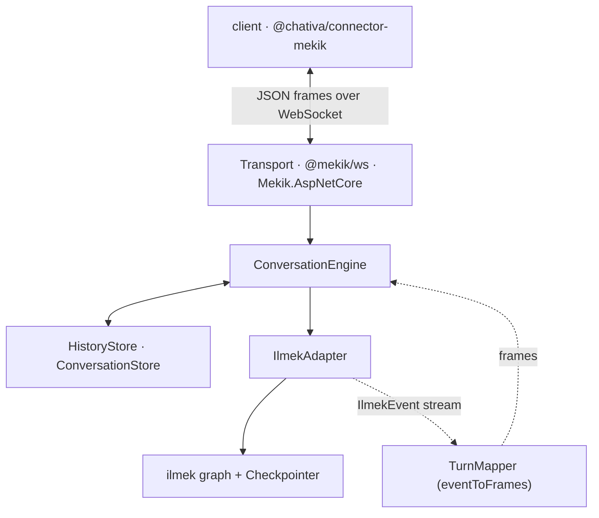
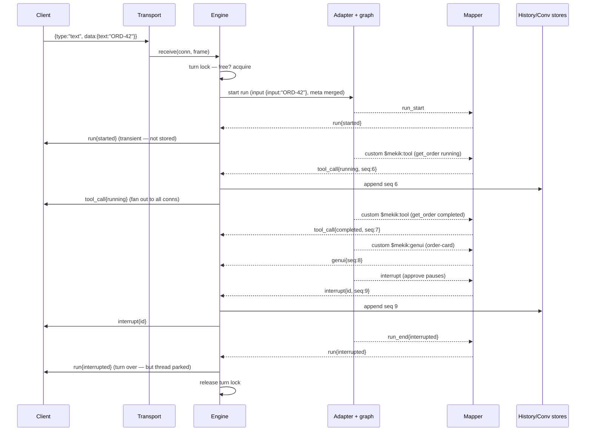
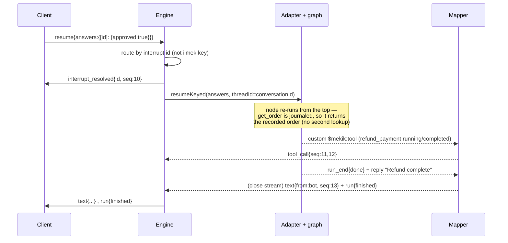

# Architecture

[Concepts](./concepts.md) names the pieces. This page traces a single turn through them, so you can see exactly where each responsibility lives and why the boundaries fall where they do.

## The stack

Read the boundaries as a set of promises:

- **Transport** promises only to move frames. It knows sockets and nothing about `seq`, interrupts, or auth. Swapping WebSocket for another transport touches nothing else.
- **Engine** promises the protocol: identity, the turn lock, fan-out, replay, resume routing. Everything multi-frame or multi-connection is here.
- **Adapter** promises to run ilmek. It starts and resumes runs and owns the checkpointer seam. It never inspects frames.
- **Mapper** promises the event→frame contract, purely. Same events in, same canonical frames out — in either language.
- **Graph** promises nothing to mekik. It's pure ilmek.

## A turn, start to finish

Follow a user typing "ORD-42" into a refund agent.

Notice the seq is assigned by the **engine**, at the moment a persistent frame is stored — the mapper proposes frames, the engine numbers and fans them out. Notice too that the transient `run{...}` frames bracket the turn but are never stored: a reconnecting client learns the turn's outcome from the persistent frames plus the parked interrupt in `welcome.pending`, not from a replayed `run` frame.

## Resume, the mirror image

When the human answers, the client sends `resume`, and the same run starts again from its checkpoint:

The **exactly-once** guarantee is visible here: the resumed node re-executes `get_order`, but because it ran inside `mekik.tool` (→ ilmek's `ctx.step`), the journal returns the recorded value and the real lookup does not fire twice. The refund, which sits *after* the pause, runs for the first time. See [Human-in-the-loop](./authoring/human-in-the-loop.md).

## Two seq spaces — do not conflate

The single subtlest thing in the architecture:

- **ilmek** stamps every event with its own per-**run** `seq`. It resets each run. It's internal to ilmek.
- **mekik** assigns persistent frames a per-**conversation** `seq` that spans every run of that conversation. *This* is the watermark.

The adapter never forwards ilmek's seq; the engine assigns mekik's. A conversation with three runs has one continuous mekik seq line (…7, 8, 9, 10, 11…) even though ilmek's event seq restarted at each run. Confusing the two is the classic port bug — [Conformance scenario 4](./parity/conformance.md) exists to catch it.

## Where state lives

| State | Owner | Lifetime |
|---|---|---|
| Parked interrupt (run suspension) | ilmek **Checkpointer** | until answered or the thread is deleted |
| Persistent-frame transcript | **HistoryStore** | until the conversation is deleted |
| Conversation record (ids, greeting-sent) | **ConversationStore** | until the conversation is deleted |
| Live connections on a conversation | **Engine** (in memory) | one process, one socket each |
| Turn lock | **Engine** (in memory) | the duration of a run |
| Current turn's GenUI stream id + chunk counter | **TurnMapper** | one run |

Two of these are process-local by design — the live-connection set and the turn lock. That's the boundary of v1: a single process fans out to its own connections and serializes its own turns. Horizontal scale means a distributed lock plus cross-node fan-out with sticky routing per `conversationId`, which is a stated non-goal for now. The durable state (checkpoint, history, conversation) already lives behind ports, so it's the connection/lock layer — not the storage layer — that a future scale-out would replace.

## The `.NET` shape

The .NET architecture is the same diagram with `Mekik.AspNetCore` in the transport box instead of `@mekik/ws`, and `Shuttle` helpers instead of `mekik.*`. The one implementation-level divergence worth knowing: an interrupt propagates as an `InterruptSignalException`, so any `try/catch` around node work must rethrow it — a blanket `catch (Exception)` would swallow the pause. `Shuttle.Tool` does this for you. See [Parity → TypeScript ↔ .NET](./parity/languages.md#the-four-deliberate-divergences).

## Where to go next

- [**Engine & turn lifecycle**](./engine.md) — the turn lock, fan-out, and concurrency rules in depth.
- [**Protocol → Event mapping**](./protocol/event-mapping.md) — the exact event→frame table the mapper implements.
- [**Persistence**](./persistence.md) — the stores and the checkpointer, and what "durable" means here.
