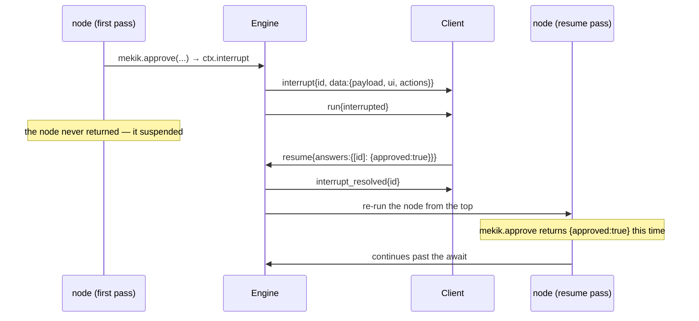

# Human-in-the-loop

mekik's headline feature is durable, interactive human-in-the-loop (HITL): a graph node pauses for a person, the pause survives a process restart, and the answer resumes the graph exactly where it stopped — **without re-running the side effects that already happened**. It's ilmek's `ctx.interrupt` / `resume` machinery (`MODEL.md §6`) surfaced as first-class protocol frames. This page is the authoring contract.

## Pausing for a human

Use `mekik.approve` (`Shuttle.Approve` in .NET), a thin wrapper over ilmek's `ctx.interrupt` that attaches presentation metadata:

<Tabs groupId="lang">
<TabItem value="ts" label="TypeScript">

```ts
const answer = await mekik.approve<{ approved: boolean }>(
  ctx,
  { title: `Refund ${order.total}?` },              // the question payload
  {
    ui: { component: "approval-form", props: { orderId: order.id } },  // mount a form
    actions: [                                                         // …or chip fallback
      { label: "Approve", value: { approved: true } },
      { label: "Reject",  value: { approved: false } },
    ],
  },
);
```

</TabItem>
<TabItem value="dotnet" label=".NET">

```csharp
var answer = await Shuttle.Approve<Dictionary<string, object?>>(
    ctx,
    new Dictionary<string, object?> { ["title"] = $"Refund {order.Total}?" },  // the question payload
    ui: new Dictionary<string, object?>                                        // mount a form
    {
        ["component"] = "approval-form",
        ["props"] = new Dictionary<string, object?> { ["orderId"] = order.Id },
    },
    actions: new List<object>                                                  // …or chip fallback
    {
        new Dictionary<string, object?> { ["label"] = "Approve", ["value"] = new Dictionary<string, object?> { ["approved"] = true } },
        new Dictionary<string, object?> { ["label"] = "Reject",  ["value"] = new Dictionary<string, object?> { ["approved"] = false } },
    });
```

</TabItem>
</Tabs>

The node **suspends** at that `await` on the first pass — it never returns. The engine emits an `interrupt` frame (carrying the question `payload`, the optional `ui`, and the `actions`) and ends the run `interrupted`. When the client answers, the graph re-runs the node from the top and the `await` returns the human's answer.

- Provide `ui` for a rich form, `actions` for quick-reply chips, or **neither** — the client then falls back to default Approve/Cancel chips.
- The question `payload` is arbitrary; whatever you pass reaches the client as `interrupt.data.payload` (with mekik's reserved `$mekik` metadata stripped).



## Answering

The client answers with a `resume` frame keyed by the **thread-scoped interrupt `id`** the `interrupt` frame carried:

```jsonc
{ "type": "resume", "answers": { "gate:interrupt#0": { "approved": true } } }
```

Two rules the engine enforces for you:

- **Answer by `id`, never by ilmek's `key`.** Two nodes pausing in one superstep can share a journal `key` (`interrupt#0`); only the thread-scoped `id` disambiguates them. Answering by `key` would silently collapse concurrent pauses to one answer — a real bug this design exists to prevent (ilmek `MODEL.md §6.1`).
- **Answer *every* open interrupt in one `resume`.** ilmek's `resumeKeyed` requires it; a `resume` that omits an open interrupt draws `error{incomplete_resume}` and starts no run. When several pauses are open (a fan-out where each branch paused), send one `resume` with every id.

The engine acknowledges each answered pause with an `interrupt_resolved` frame (so every tab, and future replay, learns it's closed), then streams the continuation.

### The form-submit shortcut

A form mounted by the interrupt's `ui` already knows its interrupt `id` (the frame carried it). The ordinary path is for it to answer with a plain `resume` on submit. As a convenience, a `genui_event{eventType:"submit", payload:{id, answer}}` whose `id` names an open interrupt is coerced by the engine to `resume{answers:{[id]: answer}}` — no server-side stream↔interrupt binding is needed. Either path resumes the same run.

## The exactly-once rule (the whole point)

Because a paused node **re-runs from the top** on resume, any side effect that ran before the pause would happen twice — unless it's journaled. Wrap every side effect in `mekik.tool` (which is `ctx.step` plus a `tool_call` trace):

<Tabs groupId="lang">
<TabItem value="ts" label="TypeScript">

```ts
.node("checkout", async (s, ctx) => {
  // Runs ONCE, ever. On the resume pass it returns the journaled order.
  const order = await mekik.tool(ctx, "create_order", { cart: s.cart },
    () => Orders.create(s.cart));

  const ok = await mekik.approve<{ approved: boolean }>(ctx, { title: `Charge ${order.total}?` });
  if (!ok.approved) return { reply: "cancelled" };

  // Everything above re-runs on resume — but create_order is memoized, so no
  // second order is opened. This charge runs only after the pause that gates it.
  await mekik.tool(ctx, "charge", { orderId: order.id }, () => Payments.charge(order));
  return { reply: "done" };
})
```

</TabItem>
<TabItem value="dotnet" label=".NET">

```csharp
.Node("checkout", async (State s, IContext ctx) =>
{
    // Runs ONCE, ever. On the resume pass it returns the journaled order.
    var order = (Order)(await Shuttle.Tool(ctx, "create_order",
        new Dictionary<string, object?> { ["cart"] = s.Get<object>("cart") },
        () => (object?)Orders.Create(s.Get<object>("cart"))))!;

    var ok = await Shuttle.Approve<Dictionary<string, object?>>(ctx,
        new Dictionary<string, object?> { ["title"] = $"Charge {order.Total}?" });
    if (ok.GetValueOrDefault("approved") is not true) return Update.Of("reply", "cancelled");

    // Everything above re-runs on resume — but create_order is memoized, so no
    // second order is opened. This charge runs only after the pause that gates it.
    await Shuttle.Tool(ctx, "charge",
        new Dictionary<string, object?> { ["orderId"] = order.Id },
        () => (object?)Payments.Charge(order));
    return Update.Of("reply", "done");
})
```

</TabItem>
</Tabs>

Two corollaries for tool authors:

- **Put a side effect *after* the pause that should gate it.** Anything before the pause re-runs (and is memoized); anything after runs only once the human has answered.
- The `tool_call` traces re-emit on the resume pass, but they're upserts by `id`, so the client just updates the existing entry — no duplicate spinners.

This is the single most important rule in mekik. If a side effect isn't idempotent and isn't behind `mekik.tool`, a resume will double it. See [Tools](./tools.md).

## Concurrent pauses

A fan-out can pause several branches in one superstep — each calls `mekik.approve`, and the run ends `interrupted` with **multiple** open interrupts, each its own `interrupt` frame with a distinct `id`:

```jsonc
{ "type": "interrupt", "seq": 9,  "id": "a:interrupt#0", "data": { "payload": { "title": "Approve A?" } } }
{ "type": "interrupt", "seq": 10, "id": "b:interrupt#0", "data": { "payload": { "title": "Approve B?" } } }
```

The `resume` must answer **both** ids at once:

```jsonc
{ "type": "resume", "answers": { "a:interrupt#0": {…}, "b:interrupt#0": {…} } }
```

Answering only one draws `error{incomplete_resume}`. This is why the `id` (not the `key`) is the addressing unit — two branches can share a `key` but never an `id`. ([Conformance scenarios 6 and 7](../parity/conformance.md) pin this.)

## Reconnecting mid-pause

Open interrupts live in ilmek's checkpoint, not in memory, so they survive a restart — provided you configured a [durable checkpointer](../persistence.md) (the in-memory default loses them). On (re)connect the `welcome` frame re-announces them in `welcome.data.pending` — each with its `ui`/`actions` — so a reopened tab re-renders the approval form and can answer it:

```jsonc
{ "type": "welcome", "data": {
    "protocol": "mekik/1", "conversationId": "conv-9", "watermark": 10,
    "pending": [ { "id": "gate:interrupt#0",
      "data": { "payload": { "title": "Refund $249.9?" },
                "ui": { "component": "approval-form", "props": {…} } } } ] } }
```

## Other controls

- **`abort`** cancels an in-flight run at the next superstep boundary; the last checkpoint stands, so the thread stays resumable. A pause already taken is unaffected.
- **A new `text` turn while parked** is refused with `error{interrupted}` — answer the open interrupt(s) first. A plain new turn would drop the pause, mirroring ilmek's own `ResumeError`. The client must send `resume`.

## Approval from an agent's tools

When a model-driven agent (LangChain, Microsoft.Extensions.AI, Semantic Kernel) decides to call a sensitive tool, you can gate that tool behind the same interrupt machinery — without hand-writing `mekik.approve`. Mark the tool `approve` in its policy and the integration pauses the graph before the tool runs:

<Tabs groupId="lang">
<TabItem value="ts" label="TypeScript">

```ts
// @mekik/langchain
withMekikTools(ctx, [refundPayment], { refund_payment: { show: true, approve: true } });
```

</TabItem>
<TabItem value="dotnet" label=".NET">

```csharp
// Mekik.Agents
MekikTools.Wrap(ctx, [refundPayment], new() { ["refund_payment"] = new ToolPolicy { Approve = new ApproveSpec() } });
```

</TabItem>
</Tabs>

The pause is an ordinary `interrupt` frame — chativa renders chips or a form, and it survives a restart like any other. Each tool gets a stable interrupt key so several approvals in one node stay separately addressable. See [Agent integrations](../integrations/overview.md).

## .NET note

In .NET the pause propagates as an `InterruptSignalException`. Any `try/catch` around node work **must rethrow** it (`Shuttle.Tool` does) — a blanket `catch (Exception)` would swallow the pause. See [Parity](../parity/languages.md#the-four-deliberate-divergences).

## Where to go next

- [**Tools**](./tools.md) — the exactly-once mechanism in depth.
- [**Protocol → Frames**](../protocol/frames.md) — the `interrupt`, `resume`, and `interrupt_resolved` shapes.
- [**Persistence**](../persistence.md) — why a durable checkpointer is what makes a pause survive a restart.
