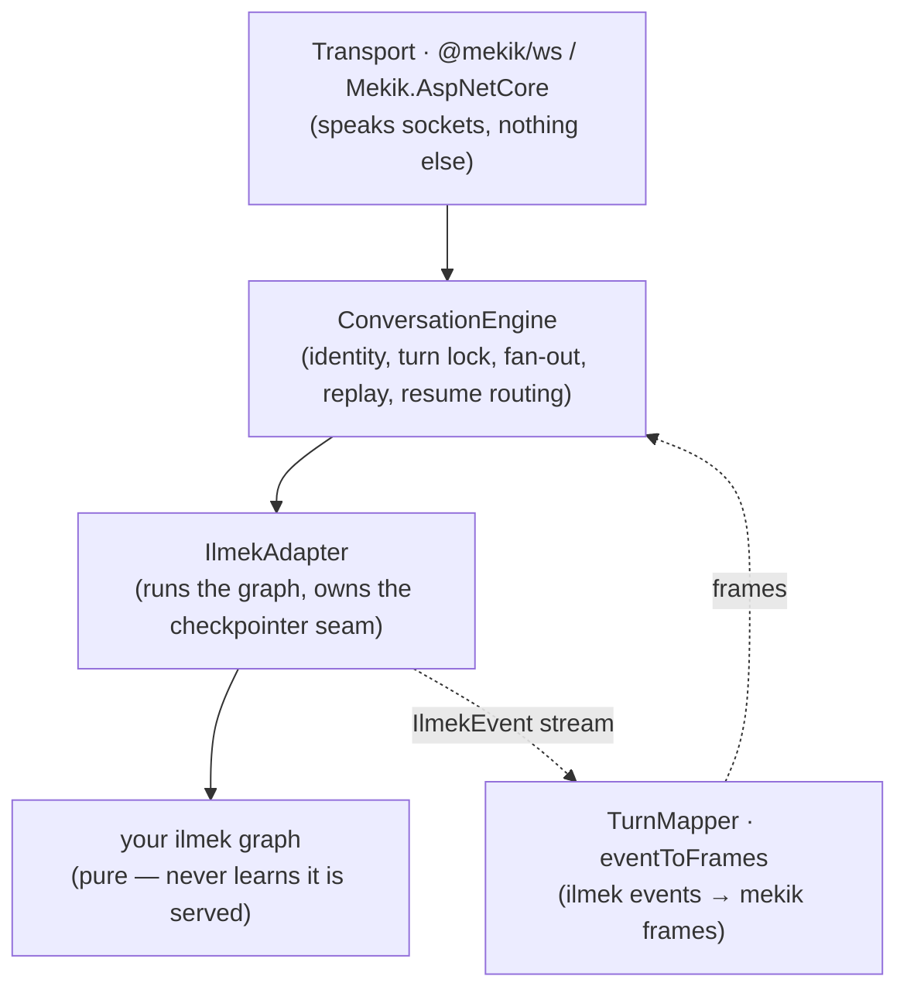

# Concepts

[Getting started](./getting-started.md) shows you can serve a graph in a dozen lines. This page explains *why* the pieces are shaped the way they are — so when you go past the happy path you know which piece to reach for.

We work outward from the graph: the thing mekik serves, then the layer that turns its events into frames, then the layer that manages connections and conversations.

## 1. The one equation

Everything starts here:

> **One ilmek graph run == one conversational turn.**

A user's `text` turn starts a run. The run yields ilmek events. mekik maps those events to wire frames and streams them to every connection on the conversation. When the run ends — finished, interrupted, errored, or aborted — the turn is over. The next `text` starts the next run.

This is why a *pause* is natural: ilmek can suspend a run mid-flight (an `interrupt`), and mekik simply reports that the turn paused rather than finished. It's why *resume* is natural: answering the pause starts the same run again from its checkpoint. And it's why *exactly-once* matters: a resumed run re-executes the node, so any side effect it already performed must be journaled or it happens twice. Hold onto the equation and the rest is corollaries.

## 2. The layers

mekik is four small pieces stacked between the transport and the graph:



- **Transport** turns a socket into a `Connection` (something with `send(frame)` and `close()`) and forwards inbound JSON to the app. It contains no protocol logic — see [Transport](./serving/transport.md).
- **`ConversationEngine`** is the heart: it runs the handshake, enforces the one-run-per-conversation turn lock, fans persistent frames out to every connection, replays what a reconnecting client missed, and routes a `resume` to the right interrupt. See [Engine & turn lifecycle](./engine.md).
- **`IlmekAdapter`** is the seam to ilmek: it starts runs and resumes, and holds ilmek's checkpointer. Nodes never touch it directly.
- **`TurnMapper`** (a.k.a. `eventToFrames`) is a pure function of one run's event stream → frames. It is the closed, fixture-checked core of the protocol. See [Event mapping](./protocol/event-mapping.md).

Your graph sits at the bottom, unaware. It's ordinary ilmek. The only mekik-specific thing in it is the authoring helpers — and those are just thin wrappers that emit ilmek `custom` events the mapper recognises.

## 3. The app — `mekik({ graph })`

`mekik(options)` is the assembly point. It wires the adapter, the ports, and the engine into one `MekikApp` that a transport can drive. Every option but `graph` has an in-memory default, so `mekik({ graph })` is a complete server.

```ts
interface MekikOptions {
  /** The ilmek graph this app serves. One run == one conversational turn. */
  graph: CompiledGraph<any>;

  /** ilmek's checkpointer (durable HITL). Default: in-memory (loses parked interrupts on restart). */
  checkpointer?: Checkpointer;

  /** Map an inbound `text` turn to the graph's input update. Default: { input: text }. */
  input?: (frame: TextInFrame) => Record<string, unknown>;

  /** Pick the run's consolidated reply text from final channel state. */
  reply?: (state: Record<string, unknown>) => string | undefined;

  /** Per-turn server context, placed at ctx.meta.mekik for nodes to read. */
  context?: (
    conv: { conversationId: string; userId: string },
    turn: { text: string; meta?: Record<string, unknown> },
  ) => Record<string, unknown>;

  /** Allowlist client-supplied meta into ctx.meta.client. Default: drop everything. */
  acceptClientMeta?: (meta: Record<string, unknown>) => Record<string, unknown> | undefined;

  /** A one-time bot message when a fresh conversation first connects. */
  greeting?: (conv: { conversationId: string; userId: string }) => string | undefined;

  /** Enable connect-time auth. */
  authenticator?: Authenticator;

  history?: HistoryStore;
  conversations?: ConversationStore;
  recursionLimit?: number;      // ilmek superstep budget per run
  minter?: IdMinter;            // override the wire id minter (tests inject a deterministic one)
  now?: () => number;           // override the clock (tests inject a fixed one)
}
```

The `MekikApp` it returns exposes three methods a transport calls — `connect(conn, params)`, `receive(conn, raw)`, `disconnect(conn)` — plus the `engine`, `adapter`, `history`, and `conversations` it assembled, so you can inspect or share them.

`reply`, `input`, `context`, and `greeting` are the four hooks that parameterize a generic graph for your app without the graph knowing anything about mekik. `context` in particular is how per-conversation data (a user id, a locale, a tenant) reaches nodes via `ctx.meta.mekik` — see [Graph context](#7-graph-context-as-a-parameter).

## 4. Frames — the wire vocabulary

A **frame** is a JSON object with a `type` discriminator. That's the entire wire. Frames split two ways.

**By direction.** Client→server frames are `hello`, `text`, `resume`, `genui_event`, `abort`. Server→client frames are `welcome`, `text`, `tool_call`, `genui`, `interrupt`, `interrupt_resolved`, `run`, `error`.

**By persistence** — this is the important axis:

```
PERSISTENT_FRAME_TYPES = ["text", "tool_call", "genui", "interrupt", "interrupt_resolved"]
```

- **Persistent** frames carry a per-conversation, strictly monotonic `seq`. They are appended to the transcript and are exactly what a reconnecting client replays. They *are* the durable record of the conversation.
- **Transient** frames (`welcome`, `run`, `error`) are live-only: never stored, never replayed. A `run{started}` you missed while offline is meaningless after the fact; a `text` bubble is not.

Getting this split right is what makes reconnect work: the server sends `welcome`, replays every persistent frame with `seq > watermark`, then resumes live delivery. The full catalogue is [Protocol → Frames](./protocol/frames.md).

## 5. The mapper — `eventToFrames`

The `TurnMapper` is a pure function from one run's ilmek event stream to mekik frames. It is *turn-stateful* — it owns the current turn's GenUI `streamId` and the per-stream chunk counter — but it holds no conversation state; the engine hands it the conversation's `seq` allocator and a deterministic id minter. That purity is what lets the [golden fixtures](./parity/conformance.md) pin it: feed both the TS and .NET mappers the same recorded events, compare canonical JSON, done.

The mapping is small enough to hold in your head. A sketch:

| ilmek event | mekik frame(s) |
|---|---|
| `run_start` | `run{started}` |
| `custom` with a token payload | a streaming `genui` text chunk |
| `custom` tagged `$mekik: "genui"` | a `genui` frame carrying the `AIChunk` |
| `custom` tagged `$mekik: "tool"` | a `tool_call` frame (upsert by `id`) |
| `interrupt` | one `interrupt` frame per pending pause |
| `run_end{done}` | close the GenUI stream, emit the consolidated `bot` `text`, then `run{finished}` |
| `run_end{interrupted \| error \| aborted}` | `run{interrupted}` / `⚠️ text` + `run{error}` / `run{aborted}` |
| node/step/state/checkpoint events | nothing in v1 (reserved for a future `debug` mode) |

The authoring helpers exist precisely so you never emit those `custom` payloads by hand — `mekik.ui` produces the `$mekik: "genui"` payload, `mekik.tool` the `$mekik: "tool"` one. The full table with conditions is [Event mapping](./protocol/event-mapping.md).

## 6. The engine — connections, conversations, the turn lock

`ConversationEngine` is where the multi-frame, multi-connection behaviours live. Four ideas:

**Identity is four ids.** `userId` (permanent), `conversationId` (the ilmek `threadId`), `connectionId` (one socket), and `watermark` (the highest persistent `seq` a client has durably seen). A conversation can have many live connections at once. See [Identity & resume](./protocol/identity.md).

**Fan-out.** Every persistent frame is broadcast to every connection on the conversation. Your own `text` turn is *not* echoed to the connection that sent it, but it *is* delivered to the conversation's other connections and written to the transcript — so a second tab sees what the first typed, and reconnect replay is complete.

**The turn lock.** One run per conversation at a time. A `text` that arrives while a run is in flight is refused with `error{busy}` to that sender only; no second run starts. This is process-local — horizontal scale needs a distributed lock and is out of scope for v1.

**Resume routing.** A `resume` frame is routed by the thread-scoped interrupt `id`, never by ilmek's task-scoped `key` — answering by `key` would silently collapse concurrent pauses. The engine emits an `interrupt_resolved` for each answered id, then streams the continuation run. See [Engine](./engine.md).

## 7. Graph context as a parameter

A node reads context via ilmek's `ctx.meta`. mekik populates three merged sources there so a generic graph can be parameterized per conversation:

| `ctx.meta.*` | Source | Set by |
|---|---|---|
| `meta.mekik` | server-computed per turn | `MekikOptions.context(conv, turn)` |
| `meta.client` | allowlisted subset of the client's `hello.meta` / frame `meta` | `MekikOptions.acceptClientMeta` (default: drop everything) |
| `meta.auth` | verified claims from the `Authenticator` | the auth port, on success |

This is the whole story of "how does my node know *which* user this is?" — the answer never involves the graph importing anything from mekik. mekik puts the data on `ctx.meta`; the node reads it. See [Authentication](./authentication.md) for `meta.auth`.

## 8. The ports — swappable seams

mekik has four ports (interfaces) with in-memory defaults, so nothing is required but the graph:

| Port | What it holds | Default | Guide |
|---|---|---|---|
| `Checkpointer` | ilmek's run state — where a pause lives | `InMemoryCheckpointer` | [Persistence](./persistence.md) |
| `HistoryStore` | the persistent-frame transcript (what reconnect replays) | `InMemoryHistoryStore` | [Persistence](./persistence.md) |
| `ConversationStore` | conversation records (users, ids, greeting-sent) | `InMemoryConversationStore` | [Persistence](./persistence.md) |
| `Authenticator` | connect-time credential verdict | none (anonymous) | [Authentication](./authentication.md) |

The ports exist; only the in-memory implementations ship in v1. Durable (Redis/Postgres) history is a stated non-goal for now — but because it's a port, adding one is a new class, not a fork.

## 9. Two languages, one wire

There are two full implementations: **TypeScript** (the reference) and **.NET** (the port). They speak byte-identical `mekik/1`. The naming differs by language convention — TS `mekik.ui(ctx, …)`, .NET `Shuttle.Ui(ctx, …)` — but the frames on the wire are the same JSON. What guarantees it is the [golden fixtures](./parity/conformance.md): both mappers replay the same recorded event streams and compare canonical JSON byte-for-byte. See [TypeScript ↔ .NET](./parity/languages.md).

## Summary

| Term | One-line summary |
|---|---|
| **Graph run = turn** | Each user turn is exactly one ilmek graph run. |
| **Frame** | A JSON object with a `type` discriminator — the whole wire. |
| **Persistent vs transient** | Persistent frames carry `seq`, are stored, and replay on reconnect; transient ones are live-only. |
| **`MekikApp`** | The assembled app — `connect` / `receive` / `disconnect`. |
| **`TurnMapper`** | Pure ilmek-events → frames; the fixture-checked core. |
| **`ConversationEngine`** | Identity, turn lock, fan-out, replay, resume routing. |
| **`IlmekAdapter`** | The seam that runs the graph and holds the checkpointer. |
| **Ports** | `Checkpointer`, `HistoryStore`, `ConversationStore`, `Authenticator` — in-memory by default. |
| **Helpers** | `mekik.text/ui/event/tool/approve` — emit the `custom` events the mapper reads. |

Next: [Architecture](./architecture.md) for how a turn flows end-to-end, or [Protocol → Overview](./protocol/overview.md) for the wire itself.
