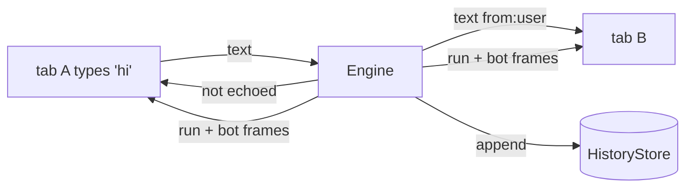

# Engine & turn lifecycle

The `ConversationEngine` owns every behaviour that spans more than one frame or more than one connection. If a rule can't be decided by looking at a single frame in isolation — "is a run already in flight?", "which tabs get this?", "is this `resume` complete?" — it lives here. This page is that rulebook.

## The three entry points

A transport drives the engine (via the `MekikApp`) with exactly three calls:

```ts
app.connect(conn, params);      // a socket opened — run the handshake
app.receive(conn, raw);         // a frame arrived on that socket
app.disconnect(conn);           // the socket closed
```

`conn` is a `Connection` — anything with `send(frame)` and `close(code?, reason?)`. The engine never constructs one; the transport does. This is the seam that keeps protocol logic out of the socket layer.

## The turn lock

The core concurrency rule is one line:

> **One run per conversation at a time.**

A per-conversation lock guards it. The lifecycle of a turn:

1. A client sends `text` (or `resume`). If the conversation already has a run in flight, the engine replies `error{code:"busy"}` **to that sender only** and drops the frame — no second run starts.
2. `run{started}` → the graph runs, streaming `genui` / `tool_call` frames as its nodes emit.
3. The run reaches a terminal state, and the engine sends the matching transient `run` frame (below).
4. The lock releases.

The lock is **process-local**. Horizontal scale — a distributed lock plus cross-node fan-out — is out of scope for v1 and would require sticky routing per `conversationId`. Within one process, the guarantee is absolute: a burst of `text` frames on one conversation runs strictly one at a time, and every extra one gets `busy`.

## The four terminal states

Every run ends in exactly one of four states, and each maps to a transient `run` frame that is always the **last** frame of its turn:

| Terminal | `run` frame | Also emitted | Meaning |
|---|---|---|---|
| done | `run{finished}` | the consolidated `bot` `text` (if the reply selector returned one) | The turn completed normally. |
| interrupted | `run{interrupted}` | one `interrupt` frame per pending pause | The graph paused for a human; the thread is parked and resumable. |
| error | `run{error}` | a `⚠️ ` `bot` `text` carrying the message | The run threw. The last checkpoint stands. |
| aborted | `run{aborted}` | — | An `abort` frame cancelled the run at a superstep boundary; the last checkpoint stands. |

`run` frames are transient — never stored, never replayed. A reconnecting client doesn't re-see `run{interrupted}`; it learns the thread is parked from `welcome.data.pending` instead. See [Frames](./protocol/frames.md#transient-frames).

## Multi-connection fan-out

A conversation may have many live connections at once — multiple tabs, a phone and a laptop. The rule:

> **Every persistent frame is broadcast to every connection on the conversation.**

With one deliberate asymmetry for the user's own turn:

- A user's `text` turn is **not** echoed back to the connection that sent it (that tab already rendered it locally).
- It **is** delivered to the conversation's *other* connections, and **is** written to the transcript.

So a second tab sees what the first tab typed, and a later reconnect replays it — the transcript is complete regardless of which connection produced each frame. This is why a user `text` frame carries `from: "user"`: it's the fan-out / replay copy of someone's own turn.



## Reconnect & replay

On every `connect`, the engine:

1. Resolves identity (mints or adopts `userId` / `conversationId`; see [Identity & resume](./protocol/identity.md)).
2. Sends a `welcome` frame with the resolved ids, the current `watermark`, and `pending` — the open interrupts re-announced so a reopened UI can re-render approval forms.
3. Replays every persistent frame with `seq > watermark`, in order.
4. Resumes live delivery.

Transient frames are never part of replay. If the client's asserted `conversationId` didn't resolve (expired, deleted), the server hands back a *different* one and the client resets its watermark to 0 — the old watermark belonged to a transcript that no longer exists.

## Resume routing

A `resume` frame answers open interrupts. Two rules the engine enforces so you don't have to:

- **Route by the thread-scoped interrupt `id`, never ilmek's task-scoped `key`.** Two nodes pausing in one superstep can share a journal `key`; only the `id` disambiguates them. Answering by `key` silently collapses concurrent pauses — a real bug this design prevents.
- **A `resume` must answer *every* open interrupt.** ilmek's `resumeKeyed` requires it. A `resume` that omits one draws `error{incomplete_resume}` and starts no run.

When the resume run starts, the engine first emits an `interrupt_resolved` frame for each answered `id` — so every tab, and future replay, learns the pause is closed — then streams the continuation run's frames. See [Human-in-the-loop](./authoring/human-in-the-loop.md#answering).

## Refusing the wrong frame at the wrong time

The engine rejects two out-of-order cases with a specific `error` code, leaving the socket open:

| Situation | Response | Why |
|---|---|---|
| `text` while a run is in flight | `error{busy}` | The turn lock. Only one run per conversation. |
| `text` while the thread is parked on an interrupt | `error{interrupted}` | A plain new turn would drop the pause (mirrors ilmek's `ResumeError`). Send `resume` instead. |
| malformed frame (bad JSON, missing `type`) | `error{bad_request}` | The frame is ignored; the connection survives. |

The distinction between `busy` and `interrupted` matters to a client: `busy` means "wait, a run is going"; `interrupted` means "you must answer the open pause before you can send a new turn."

## `abort`

An `abort` frame cancels the in-flight run at the next superstep boundary. The last checkpoint stands, so the thread stays resumable — a subsequent `resume` or `text` still works. A pause already taken is unaffected by an abort of a *different* run. Under the hood this is an `AbortController`/`AbortSignal` in TS and a `CancellationTokenSource`/`CancellationToken` in .NET (the same token ilmek's .NET run loop already takes).

## Where to go next

- [**Protocol → Identity & resume**](./protocol/identity.md) — the four ids and the watermark model in depth.
- [**Protocol → Frames**](./protocol/frames.md) — every frame shape and its persistence.
- [**Human-in-the-loop**](./authoring/human-in-the-loop.md) — the authoring side of interrupts and resume.
