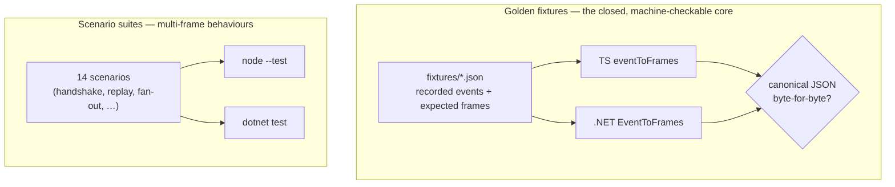

# Conformance

Two implementations, one wire. The claim that TypeScript and .NET produce byte-identical `mekik/1` is not a hope — it's checked, two ways. This page is how. The [normative source](https://github.com/AimTune/mekik/blob/main/conformance/README.md) is `conformance/README.md`; this is its tour.

## Two layers



1. **Golden fixtures** pin the *pure* `eventToFrames` mapping. Each fixture is a recorded ilmek event stream for one run plus the exact mekik frames it must produce. Both implementations replay them and compare canonical JSON. This is the closed core of the contract.
2. **Scenario suites** pin the engine behaviours that involve more than one frame or more than one run — handshake, replay, fan-out, resume routing, locking, auth. Each language writes these as ordinary tests asserting the same observable wire.

## Why fixtures work: determinism

A pure function can only be pinned if it's deterministic. `eventToFrames` isn't quite pure — it mints ids, stamps timestamps, allocates seq — so the fixtures inject deterministic versions of exactly those three things:

- a **seq allocator** starting at `startSeq + 1`, incremented once per persistent frame;
- a **deterministic id minter**: message ids `msg-1`, `msg-2`, …; stream ids `stream-1`, `stream-2`, … (each kind its own 1-based counter, minted in emit order);
- a **fixed clock** returning `1750000000000` for every `timestamp`.

Production swaps in a random minter and the wall clock — *only those differ.* The input `IlmekEvent` JSON carries a stable placeholder envelope (`runId:"run-1"`, `threadId:"conv-1"`, ilmek's own seq, `ns:[]`); the mapper ignores the envelope and assigns mekik's own seq. Fixtures are generated once by the TS reference (`pnpm --filter @mekik/core gen:fixtures`), hand-reviewed, committed, and thereafter treated as read-only goldens by both suites.

### Canonical JSON

The comparison is byte-for-byte over **canonical** JSON: UTF-8, object keys sorted ascending, no insignificant whitespace, numbers in shortest round-trip form. `canonicalize` (TS) and `Json.Canonicalize` (.NET) produce it. This is why .NET models frames as dictionaries rather than typed objects — see [Parity divergence 2](./languages.md#the-four-deliberate-divergences).

## The golden fixtures

| fixture | exercises |
|---|---|
| `run-empty` | `run_start` → `run{started}`; `run_end{done}` with no output → `run{finished}` only |
| `tokens` | `emitToken` customs → streaming `genui` text chunks; auto-close `stream_done` at run end |
| `genui-ui` | `mekik.ui` custom → `genui` ui chunk; chunk-id assignment |
| `tool-call` | `mekik.tool` running → completed customs → `tool_call` upsert by id |
| `tool-error` | tool failure → `tool_call{status:"error"}` |
| `reply-text` | `run_end{done}` + `replyChannel` → consolidated `bot` `text` after stream close |
| `single-approval` | one `interrupt` → `interrupt` frame with `ui` + `actions`; `run{interrupted}` |
| `plain-interrupt` | `ctx.interrupt` with no `$mekik` → `interrupt` frame, no `ui`/`actions` |
| `concurrent-approvals` | two pending in one `interrupt` → two `interrupt` frames, distinct ids, both preserved |
| `run-error` | `run_end{error}` → `⚠️` `text` + `run{error}` |
| `run-aborted` | `run_end{aborted}` → `run{aborted}` only, no text |
| `mixed-turn` | ui + tokens + tool + reply in one run (ordering + seq monotonicity) |

Each row is a claim about the [event→frame mapping](../protocol/event-mapping.md), frozen as JSON.

## The scenario suites

The 14 behavioural scenarios cover what a single-run fixture can't:

1. **handshake** — anonymous connect mints ids; `welcome` returns them; asserted ids adopted; a substituted `conversationId` resets client watermark to 0.
2. **watermark replay** — reconnect with `watermark = N` receives exactly the persistent frames with `seq > N`, in order, then live delivery; transient frames never replay.
3. **multi-tab fan-out** — two connections both receive every persistent frame; the sender's own `text` is not echoed to itself but is delivered to the other connection and stored.
4. **cross-run seq** — persistent `seq` is monotonic across multiple runs of one conversation (does not reset per run).
5. **single approval round-trip** — `interrupt` → `resume` → `interrupt_resolved` → continue → `run{finished}`.
6. **concurrent interrupts routed by id** — two pending; a `resume` answering both ids resumes correctly; answering by ilmek `key` would collapse them (must not).
7. **incomplete resume rejected** — answering only one of two draws `error{incomplete_resume}` and starts no run; answering both finishes it.
8. **reconnect while interrupted** — `welcome.data.pending` re-announces open interrupts with their `ui`/`actions`.
9. **genui-form submit** — `genui_event{eventType:"submit", payload:{id, answer}}` naming an open interrupt is coerced to a `resume`.
10. **abort** — an `abort` ends the run `aborted`; the last checkpoint stands; a later `resume`/`text` still works.
11. **turn lock** — a second `text` while a run is in flight gets `error{busy}`; only one run executes.
12. **new turn while interrupted** — a `text` (not `resume`) while parked draws `error{interrupted}` and starts no run.
13. **auth reject** — bad token → `error{unauthorized}` + WS close 4401; a verified `userId` overrides a spoofed asserted one; `claims` reach `meta.auth`.
14. **exactly-once under replay** — a `mekik.tool` side effect before an interrupt runs once across the pause/resume (observed as one `tool_call{running}` id, not two).

> **The scenarios ports tend to break** (mirroring ilmek's own list): **6 and 7** (id-vs-key routing), **8** (pending re-announce), **12** (refuse a new turn while parked), and **14** (replay idempotence). If you're porting mekik to a third language, write these four first.

## Running it

```bash
# TypeScript — golden fixtures + behavioural scenarios via node --test
cd ts && pnpm check

# .NET — replays the SAME fixtures through its own EventToFrames, canonical compare
cd dotnet && dotnet test Mekik.slnx
```

The .NET suite loading the *same* fixture files and comparing canonical JSON is what proves the two implementations produce identical wire — not two parallel test suites that happen to agree, but one set of goldens replayed through both mappers.

> **CI gotcha worth knowing:** `[CallerFilePath]` can't locate repo files in CI because deterministic builds rewrite source paths to `/_/`. The fixtures are copied to the test output directory and resolved via `AppContext.BaseDirectory` instead.

## Where to go next

- [**TypeScript ↔ .NET**](./languages.md) — the naming map and the divergences these tests hold in place.
- [**Protocol → Event mapping**](../protocol/event-mapping.md) — the mapping the fixtures pin.
- [**Engine & turn lifecycle**](../engine.md) — the behaviours the scenario suites cover.
