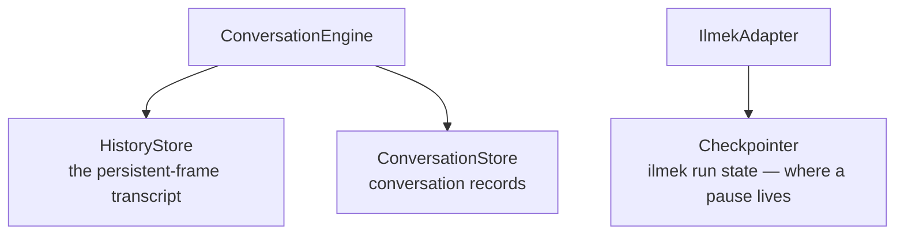

# Persistence

mekik keeps three kinds of durable state, each behind a port with an in-memory default. This page is what each one holds, why it's separate, and what changes when you make it durable.

## The three stores



| Store | Holds | Answers the question | Default |
|---|---|---|---|
| **`Checkpointer`** (ilmek's) | run state — channel values, the parked interrupt | "where do I resume this thread?" | `InMemoryCheckpointer` |
| **`HistoryStore`** | the ordered persistent frames of a conversation | "what does a reconnecting client replay?" | `InMemoryHistoryStore` |
| **`ConversationStore`** | conversation records — ids, user, greeting-sent flag | "does this conversation exist? has it been greeted?" | `InMemoryConversationStore` |

They are separate because they answer different questions at different layers. The checkpointer belongs to **ilmek** (mekik hands it in via `MekikOptions.checkpointer`); the other two are mekik's own.

## Why the checkpointer is the important one

An interrupt is a *suspended run*, and a suspended run lives in the checkpoint — not in memory, not in the transcript. That has a direct consequence:

> With the default `InMemoryCheckpointer`, a process restart loses every parked interrupt. A durable checkpointer is what makes human-in-the-loop survive a deploy.

If your graph pauses for a human who might answer minutes or hours later — across a restart, a scale event, a crash — you need a durable ilmek checkpointer. Pass it in:

```ts
import { mekik } from "@mekik/core";
import { SomeDurableCheckpointer } from "@ilmek/…"; // an ilmek checkpointer implementation

const app = mekik({
  graph: g,
  checkpointer: new SomeDurableCheckpointer(/* … */),
});
```

The checkpointer is ilmek's contract, not mekik's — mekik only threads it into the adapter. Anything that satisfies ilmek's `Checkpointer` works. See ilmek's own docs for the available implementations.

## HistoryStore — the transcript

The `HistoryStore` holds the persistent frames (`text`, `tool_call`, `genui`, `interrupt`, `interrupt_resolved`) in `seq` order. It is exactly what reconnect replays: the engine reads "every frame with `seq > watermark`" from it. Transient frames (`welcome`, `run`, `error`) are never written here — they're live-only.

```ts
interface HistoryStore {
  append(conversationId: string, frame: PersistentFrame): Promise<void> | void;
  since(conversationId: string, watermark: number): Promise<PersistentFrame[]> | PersistentFrame[];
  // …
}
```

The in-memory default keeps a per-conversation array. A durable implementation (Redis list, Postgres table) has the same shape — append on emit, range-query on reconnect. Durable history is a **stated non-goal for v1** (the port exists; only in-memory ships), but because it's a port, adding one is a new class rather than an engine change.

## ConversationStore — the records

The `ConversationStore` tracks conversation-level facts the engine needs across turns and connections:

```ts
interface ConversationRecord {
  conversationId: string;
  userId: string;
  greetingSent?: boolean;
  // …
}
```

The most visible use is the **greeting**: `MekikOptions.greeting` fires a one-time bot message when a *fresh* conversation first connects. The store's `greetingSent` flag is how the engine knows not to greet again on reconnect — the transcript already has the greeting, so replay covers it. Without a persisted flag a restart would re-greet an existing conversation.

## Swapping a store

All three are constructor options on the app. Provide the ones you want durable; omit the rest to keep the in-memory default:

<Tabs groupId="lang">
<TabItem value="ts" label="TypeScript">

```ts
const app = mekik({
  graph: g,
  checkpointer: myDurableCheckpointer,   // ilmek's port — survives restart
  history: myHistoryStore,               // mekik's HistoryStore
  conversations: myConversationStore,    // mekik's ConversationStore
});
```

</TabItem>
<TabItem value="dotnet" label=".NET">

```csharp
var app = new MekikApp(new MekikOptions
{
    Graph = graph,
    Checkpointer  = myDurableCheckpointer, // ilmek's port — survives restart
    History       = myHistoryStore,        // IHistoryStore
    Conversations = myConversationStore,   // IConversationStore
});
```

</TabItem>
</Tabs>

The .NET ports follow the interface-name convention — `IHistoryStore` / `IConversationStore` (see [Parity](./parity/languages.md)).

## What "durable" buys you, feature by feature

| If you make durable… | You gain |
|---|---|
| **Checkpointer** | Parked interrupts survive a restart — a human can answer after a deploy. |
| **HistoryStore** | Transcript survives a restart — reconnect replay works after the process that produced the frames is gone. |
| **ConversationStore** | Greeting-once and conversation identity survive a restart. |

For a single long-lived process that never restarts mid-conversation, the in-memory defaults are enough — which is why they're the defaults. The moment "answer this approval tomorrow" or "survive a deploy" enters the requirements, the checkpointer and history need backing.

## Where to go next

- [**Protocol → Identity & resume**](./protocol/identity.md) — the watermark model the HistoryStore serves.
- [**Human-in-the-loop**](./authoring/human-in-the-loop.md) — why a parked interrupt lives in the checkpoint.
- [**Concepts → Ports**](./concepts.md#8-the-ports--swappable-seams) — the port model these stores follow.
