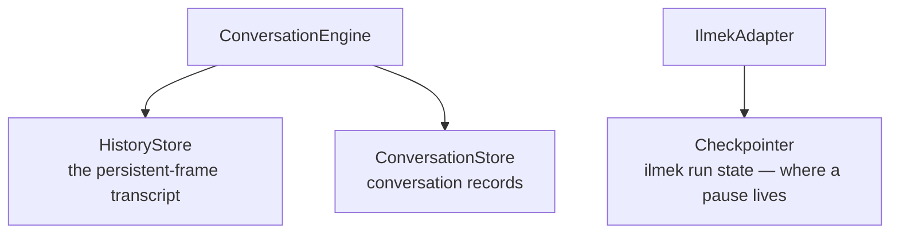

# Persistence

mekik keeps three kinds of durable state, each behind a port with an in-memory default. This page is what each one holds, why it's separate, and what changes when you make it durable.

## The three stores


```mermaid
flowchart TD
  E[ConversationEngine] --> H["HistoryStore<br/>the persistent-frame transcript"]
  E --> C["ConversationStore<br/>conversation records"]
  A[IlmekAdapter] --> K["Checkpointer<br/>ilmek run state — where a pause lives"]
```

| Store | Holds | Answers the question | Default |
|---|---|---|---|
| **`Checkpointer`** (ilmek's) | run state — channel values, the parked interrupt | "where do I resume this thread?" | `InMemoryCheckpointer` |
| **`HistoryStore`** | the ordered persistent frames of a conversation | "what does a reconnecting client replay?" | `InMemoryHistoryStore` |
| **`ConversationStore`** | conversation records — id, owner `userId`, `createdAt`, `meta` | "does this conversation exist, and whose is it?" | `InMemoryConversationStore` |

They are separate because they answer different questions at different layers. The checkpointer belongs to **ilmek** (mekik hands it in via `MekikOptions.checkpointer`); the other two are mekik's own.

## Why the checkpointer is the important one

An interrupt is a *suspended run*, and a suspended run lives in the checkpoint — not in memory, not in the transcript. That has a direct consequence:

> With the default `InMemoryCheckpointer`, a process restart loses every parked interrupt. A durable checkpointer is what makes human-in-the-loop survive a deploy.

If your graph pauses for a human who might answer minutes or hours later — across a restart, a scale event, a crash — you need a durable ilmek checkpointer. Pass it in:

```ts
import { mekik } from "@mekik/core";
import { SomeDurableCheckpointer } from "@ilmek/…"; // an ilmek checkpointer implementation

const app = mekik({
  graph: g,
  checkpointer: new SomeDurableCheckpointer(/* … */),
});
```

The checkpointer is ilmek's contract, not mekik's — mekik only threads it into the adapter. Anything that satisfies ilmek's `Checkpointer` (`ICheckpointer` in .NET) works — ilmek publishes `@ilmek/checkpoint-sqlite` and `@ilmek/checkpoint-postgres` on npm and `Ilmek.Checkpointer.Sqlite` on NuGet; pick the version that matches the `@ilmek/core` / `Ilmek.Core` your mekik depends on. See ilmek's own docs for details.

## HistoryStore — the transcript

The `HistoryStore` holds the persistent frames (`text`, `tool_call`, `genui`, `interrupt`, `interrupt_resolved`, and any [rich message frame](./authoring/messages.md)) in `seq` order. It is exactly what reconnect replays: the engine reads "every frame with `seq > watermark`" from it. Transient frames (`welcome`, `genui_components`, `skills`, `run`, `error`) are never written here — they're live-only.

<Tabs groupId="lang">
<TabItem value="ts" label="TypeScript">

```ts
interface HistoryStore {
  /** Persist an already-seq-stamped persistent frame. */
  record(conversationId: string, frame: PersistentFrame): Promise<void>;
  /** Persistent frames with seq > watermark, ascending — the reconnect replay. */
  after(conversationId: string, watermark: number): Promise<PersistentFrame[]>;
  /** Highest seq stored for the conversation, or 0 — seeds the engine's counter. */
  currentSeq(conversationId: string): Promise<number>;
}
```

</TabItem>
<TabItem value="dotnet" label=".NET">

```csharp
public interface IHistoryStore
{
    Task RecordAsync(string conversationId, IReadOnlyDictionary<string, object?> frame);
    Task<IReadOnlyList<IReadOnlyDictionary<string, object?>>> AfterAsync(string conversationId, long watermark);
    Task<long> CurrentSeqAsync(string conversationId);
}
```

</TabItem>
</Tabs>

The engine assigns `seq` — the store only persists and ranges. `currentSeq` is read when a node first sees a conversation, to seed its counter. The in-memory default keeps a per-conversation array. A durable implementation (Redis sorted set, Postgres table) has the same shape — record on emit, range-query on reconnect. mekik ships only the in-memory store; a durable one is bring-your-own, but because it's a port, adding one is a new class rather than an engine change.

## ConversationStore — the records

The `ConversationStore` is the conversation registry — who owns each conversation:

<Tabs groupId="lang">
<TabItem value="ts" label="TypeScript">

```ts
interface ConversationRecord {
  conversationId: string;
  userId: string;                  // the owner
  createdAt: number;
  meta: Record<string, unknown>;
}

interface ConversationStore {
  get(conversationId: string): Promise<ConversationRecord | null>;
  create(record: ConversationRecord): Promise<void>;
}
```

</TabItem>
<TabItem value="dotnet" label=".NET">

```csharp
public sealed record ConversationRecord(string ConversationId, string UserId, long CreatedAt, IReadOnlyDictionary<string, object?> Meta);

public interface IConversationStore
{
    Task<ConversationRecord?> GetAsync(string conversationId);
    Task CreateAsync(ConversationRecord record);
}
```

</TabItem>
</Tabs>

Its job is the resume check at connect: a client-asserted `conversationId` is adopted only if the record exists **and** belongs to the connecting user; otherwise the engine mints a fresh conversation and the client resets its watermark. Open interrupts are not here — they live in ilmek's checkpoint.

The **greeting** rides on the transcript instead: `MekikOptions.greeting` fires a one-time bot message when a conversation with nothing in its transcript first connects. The greeting is itself a persistent frame, so a reconnect replays it instead of greeting twice — and with a durable `HistoryStore`, a restart doesn't re-greet an existing conversation.

## Swapping a store

All three are constructor options on the app. Provide the ones you want durable; omit the rest to keep the in-memory default:

<Tabs groupId="lang">
<TabItem value="ts" label="TypeScript">

```ts
const app = mekik({
  graph: g,
  checkpointer: myDurableCheckpointer,   // ilmek's port — survives restart
  history: myHistoryStore,               // mekik's HistoryStore
  conversations: myConversationStore,    // mekik's ConversationStore
});
```

</TabItem>
<TabItem value="dotnet" label=".NET">

```csharp
var app = new MekikApp(new MekikOptions
{
    Graph = graph,
    Checkpointer  = myDurableCheckpointer, // ilmek's port — survives restart
    History       = myHistoryStore,        // IHistoryStore
    Conversations = myConversationStore,   // IConversationStore
});
```

</TabItem>
</Tabs>

The .NET ports follow the interface-name convention — `IHistoryStore` / `IConversationStore` (see [Parity](./parity/languages.md)).

## What "durable" buys you, feature by feature

| If you make durable… | You gain |
|---|---|
| **Checkpointer** | Parked interrupts survive a restart — a human can answer after a deploy. |
| **HistoryStore** | Transcript survives a restart — reconnect replay works after the process that produced the frames is gone, the `seq` counter re-seeds correctly, and the greeting isn't sent twice. |
| **ConversationStore** | Conversation identity and ownership survive a restart — a returning client resumes its conversation instead of getting a new one. |

For a single long-lived process that never restarts mid-conversation, the in-memory defaults are enough — which is why they're the defaults. The moment "answer this approval tomorrow" or "survive a deploy" enters the requirements, the checkpointer and history need backing. Running several nodes adds two more ports, `turnLock` and `backplane` — see [Horizontal scale](./scaling.mdx).

## Where to go next

- [**Protocol → Identity & resume**](./protocol/identity.md) — the watermark model the HistoryStore serves.
- [**Human-in-the-loop**](./authoring/human-in-the-loop.md) — why a parked interrupt lives in the checkpoint.
- [**Concepts → Ports**](./concepts.md#8-the-ports--swappable-seams) — the port model these stores follow.
