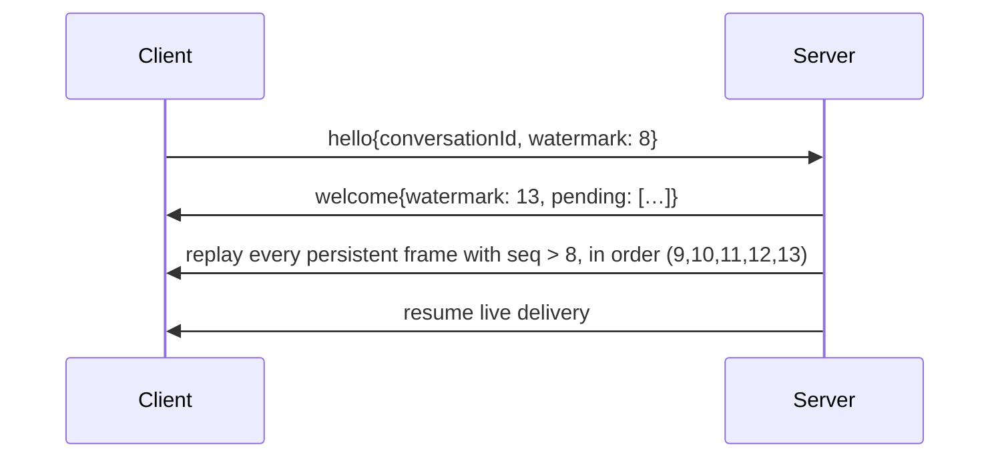

# Identity & resume

Resume is the feature that makes a chat feel durable: close the tab, come back, and the conversation is exactly where you left it — mid-transcript, open approvals still open. That works because of four ids and one watermark. This page is that model.

## The four ids

| id | lifetime | owns |
|---|---|---|
| `userId` | permanent | the user's cross-conversation store (`user:{userId}`) |
| `conversationId` | until deleted | the transcript, the conversation record, **and** the ilmek `threadId` |
| `connectionId` | one socket | nothing — a routing handle for one live connection |
| `watermark` | per client | the highest persistent-frame `seq` this client has durably seen |

The load-bearing identity is `conversationId` **is** the ilmek `threadId`. That single equation ties a conversation's transcript to a resumable graph thread: to resume a conversation is to resume its ilmek thread from the checkpoint keyed by that same id.

## Anonymous connect and adoption

A client may assert any subset of the ids in `hello`, or none. The server fills in whatever's missing and announces the result in `welcome`:

```jsonc
// client asserts nothing
{ "type": "hello" }

// server mints and returns
{ "type": "welcome", "data": {
    "protocol": "mekik/1", "userId": "u-7a3", "conversationId": "conv-1f9",
    "connectionId": "connection-abc", "watermark": 0, "pending": [] } }
```

A client that asserts ids **adopts whatever the server returns**. Usually the server honours the asserted ids. But there's one case where it substitutes:

> If the server hands back a **different** `conversationId` than the one asserted (the old one expired or was deleted), the client **must reset its watermark to 0**. The old watermark counted frames in a transcript that no longer exists.

This is the subtle rule ports get wrong. A stale watermark against a fresh conversation would skip the beginning of the new transcript. Resetting to 0 replays it in full.

## The watermark and replay

Every persistent frame (`text`, `tool_call`, `genui`, `interrupt`, `interrupt_resolved`) carries a per-conversation, strictly monotonic, gap-free `seq`. The **watermark** is the highest `seq` a client has durably received.

On (re)connect:



The client learns the server's current high-water mark from `welcome.data.watermark`, then receives exactly the frames it missed. Transient frames are **never** replayed — a `run{started}` from an hour ago is noise; a `text` bubble is the record.

### Two seq spaces — do not conflate

The classic port bug, worth repeating:

- **ilmek** stamps each event with a per-**run** `seq` that resets every run. Internal to ilmek.
- **mekik** assigns persistent frames a per-**conversation** `seq` that spans every run. *This* is the watermark.

A conversation with three runs has one continuous mekik seq line even though ilmek's event seq restarted three times. The adapter never forwards ilmek's seq; the engine assigns mekik's. [Conformance scenario 4](../parity/conformance.md) pins exactly this.

## Multi-tab and multi-device fan-out

A conversation can have many live connections at once. The rule:

> Every persistent frame is broadcast to **every** connection on the conversation.

With one asymmetry for the sender's own turn:

- A user's `text` is **not** echoed to the connection that sent it (that tab rendered it locally).
- It **is** delivered to the conversation's *other* connections as a `text` frame with `from:"user"`, and **is** written to the transcript.

So opening a second tab shows the same live conversation, a phone and a laptop stay in sync, and reconnect replay is complete regardless of which device produced each frame. The `from:"user"` persistent frame is what makes "the other tab" and "the reconnect" see your own messages.

## Reconnecting mid-pause

Open interrupts live in ilmek's checkpoint, not in memory, so they survive a restart (with a [durable checkpointer](../persistence.md)). On (re)connect, the `welcome` frame re-announces them in `welcome.data.pending` — each a `PendingView` carrying its `payload`, `ui`, and `actions` — so a reopened tab re-renders the approval form and can answer it. Without this, a reconnecting UI would replay the `interrupt` frame from history but a client that only tracks *live* interrupts would miss it; `pending` makes the open set explicit at connect time.

## Client-side resume, in practice

This is the **client** end — the chativa browser widget, which is TypeScript-only (mekik ships no .NET client; a .NET app is the *server*). chativa's connector persists the identity and watermark to `localStorage` (under `chativa:mekik:<url>`) when you pass `resumeConversation: true`, so a page reload rejoins the same conversation:

```ts
new MekikConnector({ url: "wss://bot.example.com/chat", resumeConversation: true });
```

On the wire that's just a `hello` carrying the stored `conversationId` and `watermark` — plain JSON, so **any** client in any language can do the same by remembering the two values from `welcome` and asserting them on the next connect.

## Where to go next

- [**Frames**](./frames.md) — the `welcome`, `text`, and `interrupt` shapes referenced here.
- [**Engine & turn lifecycle**](../engine.md) — fan-out and replay from the engine's side.
- [**Authentication**](../authentication.md) — how a verified `userId` overrides a client-asserted one.
