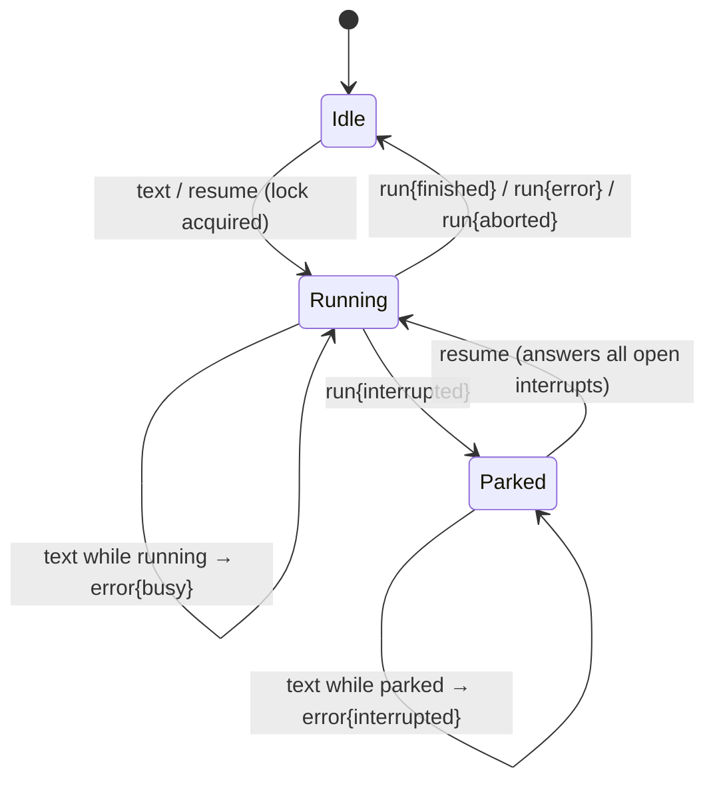

# Protocol overview

This section narrates **`mekik/1`**, the wire protocol both implementations speak. It is the companion to [`PROTOCOL.md`](https://github.com/AimTune/mekik/blob/main/PROTOCOL.md) — the normative spec in the repo — not a replacement.

> **Where prose and the golden fixtures disagree, the fixtures win.** These pages explain the protocol; the [fixtures](../parity/conformance.md) *are* the protocol. If you're porting mekik to a third language, read `PROTOCOL.md` and the fixtures, and treat this section as the tour guide.

## The protocol in one screen

Frames are JSON objects with a `type` discriminator, exchanged over WebSocket, one frame per message, UTF-8. There are two axes that organize everything:

**Direction.**

```
client → server:  hello · text · resume · genui_event · abort
server → client:  welcome · text · tool_call · genui · interrupt · interrupt_resolved · run · error
```

**Persistence.** This is the axis that makes reconnect work:

```
PERSISTENT (carry a per-conversation seq, stored, replayed):
  text · tool_call · genui · interrupt · interrupt_resolved

TRANSIENT (live-only, never stored, never replayed):
  welcome · run · error
```

A persistent frame is the durable record of the conversation. A transient one is a live signal that's meaningless after the fact. On (re)connect the server sends `welcome`, replays every persistent frame with `seq > watermark`, then resumes live delivery.

Full shapes: [Frames](./frames.md).

## The version and the compatibility rule

```
PROTOCOL_VERSION = "mekik/1"
```

It's announced in `welcome.data.protocol`. The compatibility contract is two sentences:

- A **major** bump (`mekik/2`) is breaking.
- Within a major, a receiver **must ignore** unknown fields and unknown frame `type`s.

That second rule is what lets a newer server add a field or a frame without breaking an older client — additive changes are always safe. Both implementations enforce it: an unknown `type` is dropped, not an error.

## Identity in four ids

```
userId          permanent      the user's cross-conversation store
conversationId  until deleted   the transcript AND the ilmek threadId
connectionId    one socket      a routing handle for one live connection
watermark       per client      the highest persistent seq this client has durably seen
```

`conversationId` **is** the ilmek `threadId` — that identity is the hinge that ties a conversation to a resumable graph thread. Anonymous connect is allowed: assert nothing and the server mints `userId` / `conversationId` and returns them in `welcome`. Full model, including the reset-to-zero rule: [Identity & resume](./identity.md).

## The turn lifecycle



One run per conversation at a time. A `text` while a run is in flight draws `error{busy}`; a `text` while the thread is parked draws `error{interrupted}` (you must `resume`). The full rulebook is [Engine & turn lifecycle](../engine.md).

## The event→frame contract

The server side of mekik is, at its core, one pure function: **`eventToFrames`** maps an ilmek run's typed event stream to mekik frames. It's turn-stateful (owns the GenUI stream id and chunk counter) but conversation-stateless (the engine hands it the seq allocator and id minter). That purity is what the golden fixtures pin. The full mapping table: [Event mapping](./event-mapping.md).

## What travels: the shared payload types

Two payload shapes are shared verbatim with chativa, so the widget renders them unchanged:

**`AIChunk`** — the unit of generative UI:

```ts
type AIChunk =
  | { type: "ui"; component: string; props?: Record<string, unknown>; id?: string | number }
  | { type: "text"; content: string; id?: string | number }
  | { type: "event"; name: string; payload?: unknown; id?: string | number };
```

**`MessageAction`** — an interrupt/quick-reply chip:

```ts
type MessageAction = { label: string; value?: unknown };
// when value is omitted, the answer is the label string
```

## Sections in this reference

- [**Frames**](./frames.md) — every frame's shape, direction, and persistence, with examples.
- [**Identity & resume**](./identity.md) — the four ids, the watermark, multi-tab fan-out, and the reset rule.
- [**Event mapping**](./event-mapping.md) — the canonical `IlmekEvent` → frame table, and interrupt payload wrapping.

For the authoring side — how *you* cause these frames from inside a node — see [Authoring → Helpers](../authoring/helpers.md).
