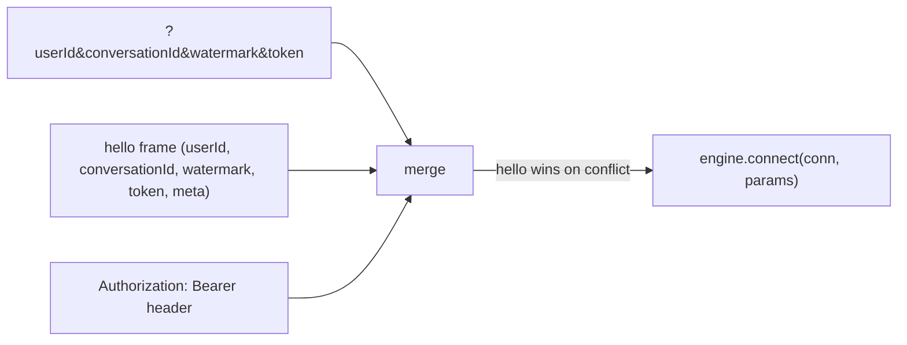

# Transport (WebSocket)

A transport turns a socket into a `Connection` the engine can drive and forwards inbound frames to the app. That's all it does — **every protocol rule lives in the engine**. mekik ships two transports: `@mekik/ws` for Node, `Mekik.AspNetCore` for ASP.NET Core. Both speak the same `mekik/1` wire.

WebSocket is the reference transport in v1. The frame shapes are transport-agnostic, so SSE / Socket.IO / SignalR profiles *could* be added later carrying identical frames — but only WebSocket ships today.

## Serving a MekikApp

<Tabs groupId="lang">
<TabItem value="ts" label="TypeScript">

```ts
import { mekik } from "@mekik/core";
import { serveWs } from "@mekik/ws";

const app = mekik({ graph });
const handle = serveWs(app, { port: 8800, path: "/ws" }); // omit `path` to accept any path
```

</TabItem>
<TabItem value="dotnet" label=".NET">

```csharp
using Mekik.Core;
using Mekik.AspNetCore;

var web = WebApplication.CreateBuilder(args).Build();

web.UseWebSockets();
web.MapMekik("/ws", new MekikApp(new MekikOptions { Graph = graph }));
web.Run();
```

`MapMekik` extends `IEndpointRouteBuilder`, so it slots into ordinary ASP.NET Core routing alongside your other endpoints. Same wire, same engine behind it.

</TabItem>
</Tabs>

## Node options (`@mekik/ws`)

`serveWs` options:

```ts
interface ServeWsOptions {
  port?: number;    // port to listen on (ignored when `server` is supplied)
  path?: string;    // only accept upgrades on this path; omit to accept ANY path
  server?: Server;  // attach to an existing http.Server instead of creating one
}
```

It returns a `ServeWsHandle` — `{ server, wss, close() }` — so a test or process can shut it and every live socket down:

```ts
process.on("SIGINT", () => void handle.close().then(() => process.exit(0)));
```

### Attaching to an existing server

To share a port with your HTTP app, pass an existing `http.Server`:

```ts
import { createServer } from "node:http";
const server = createServer(myHttpHandler);
serveWs(app, { server, path: "/ws" });
server.listen(3000);
```

### Omit `path` to accept anything

`path` filters which upgrade requests are accepted. Omit it and the transport accepts the upgrade on **any** path — useful when a client might point at `/chat` while you were thinking `/ws`. The repo's `refund.ts --serve` does exactly this so the demo just connects.

## How identity reaches the engine

Identity can arrive two ways, and the transport **merges** them at connect, with the `hello` frame winning on conflict:

1. **The WS query string** — `wss://host/ws?userId=u-1&conversationId=conv-9&watermark=12&token=…`. Read from the upgrade request URL. This is the only channel available to something upstream of mekik (an edge proxy authenticating at the HTTP handshake), because it can't see the `hello` frame.
2. **The first `hello` frame** — `{type:"hello", userId, conversationId, watermark, token, meta}`. The richer channel; it also carries `meta`, which the query string can't.

The transport also reads an `Authorization: Bearer` header into the credential if no token came another way (browsers can't set WebSocket headers, but a non-browser client or a proxy can).



The merged result is a `ConnectParams` — `{ hello, credential }` — handed to `app.connect(conn, params)`. The `credential` carries the token, the raw headers (for a cookie/session authenticator), and the raw query params. See [Authentication](../authentication.md).

## Ordering guarantees the transport keeps

The Node transport serializes per socket so the protocol invariants hold:

- **The handshake finishes before any frame is delivered.** `app.connect` must complete before the first `app.receive`, or replay would race live frames.
- **Frames stay in order.** Inbound frames chain through a per-socket promise, so `receive` calls never overlap or reorder.
- A non-`hello` first frame (identity came via the query string) is still processed after the handshake, not dropped.

These are transport responsibilities precisely because they're about the socket, not the protocol. The engine assumes ordered, post-handshake delivery; the transport provides it.

## Errors and close codes

- A handler that throws surfaces as an `error{code:"internal"}` frame if the socket is still open — it doesn't take the connection down silently.
- An **auth reject** closes with WebSocket code **4401** (`AUTH_CLOSE_CODE`) after the `error{unauthorized}` frame. (WS requires close codes in `1000` / `1002–1014` / `3000–4999`; 4401 sits in the app range.) See [Authentication](../authentication.md).

## Writing another transport

Because the engine is transport-free, a new transport is small: implement `Connection` (`send(frame)`, `close(code?, reason?)`), build a `ConnectParams` from whatever your transport carries, and call `connect` / `receive` / `disconnect` on the `MekikApp`. Keep the ordering guarantees above and every protocol rule comes along for free. The [`@mekik/ws` source](https://github.com/AimTune/mekik/blob/main/ts/packages/ws/src/index.ts) is ~150 lines and is the reference to copy.

## Where to go next

- [**Authentication**](../authentication.md) — the credential the transport assembles and how it's verified.
- [**Protocol → Identity & resume**](../protocol/identity.md) — what the merged `hello` params mean.
- [**Engine & turn lifecycle**](../engine.md) — what the engine does with `connect` / `receive` / `disconnect`.
